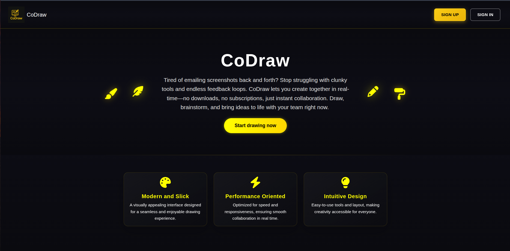
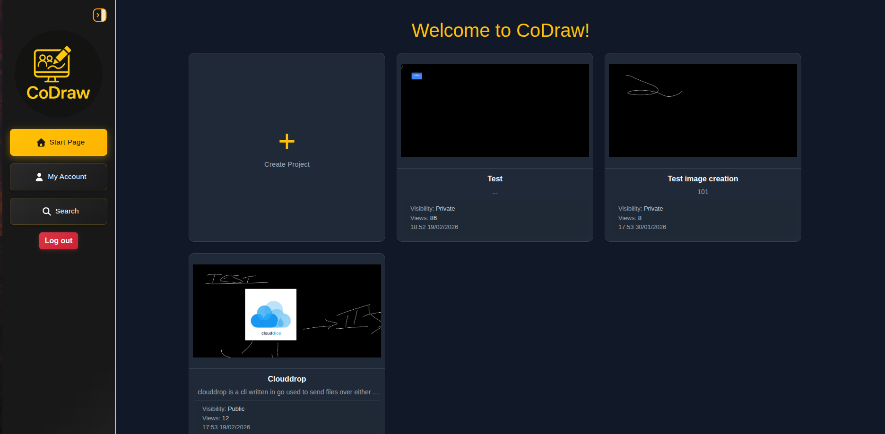
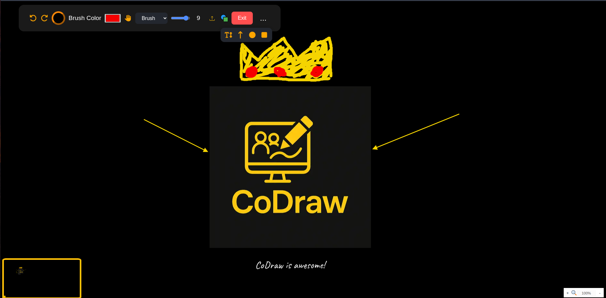
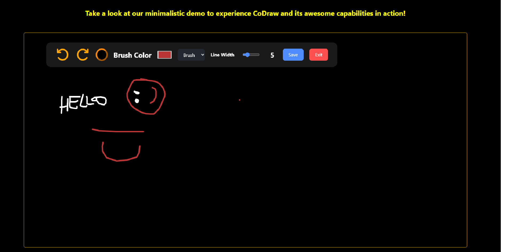

### **CODRAW**
An interactive whiteboard platform aimed at providing a seemless experience for the usage of interactive virtual boards. Collaborate, share and innovate!

<table>
  <tr>
    <td></td>
    <td></td>
  </tr>
   <tr>
    <td></td>
    <td></td>
  </tr>
</table>

### Key Features
* Real-time collaboration by means of web sockets.
* Project browsing capabilities thanks to natural language processing.
* Invitations via a link functionality.
* Mail based account creation(providing a passkey).
* Password recovery.
* Rich board customisations & Bookmarks!

### Tech Stack
**Frontend:** Vue.js, Bootstrap <br>
**Backend:** Django(asgi/dafne), MongoDB
### Booting and Contributing
For testing purposes leverage, provided docker-compose.yaml file by running command docker compose up.
If you would like to contribute you will need to add:

1) .env file to /frontend directory with mapped variable:
```terminal 
VUE_APP_BASE_URL=<YOUR_LOCAL_HOST_PATH> //i.e http://localhost:8000
```
2) .env file to root project directory with following variables mapped:
```terminal
GMAIL_PASS=<YOUR_GMAIL_APP_PASSWORD> //for signing up interaction
VUE_APP_BASE_URL=<YOUR_LOCAL_HOST_PATH> //i.e http://localhost:8000
MONGO_INITDB_ROOT_USERNAME=<YOUR_MONGO_ROOT_USERNAME>
MONGO_INITDB_ROOT_PASSWORD=<YOUR_MONGO_ROOT_PASSWORD>
```
### Helpful commands
1) instantiating redis for local development using docker:
```
docker pull redis
docker run --name my-redis -p 6379:6379 -d redis
docker exec -it my-redis redis-cli ping
docker stop my-redis
```


