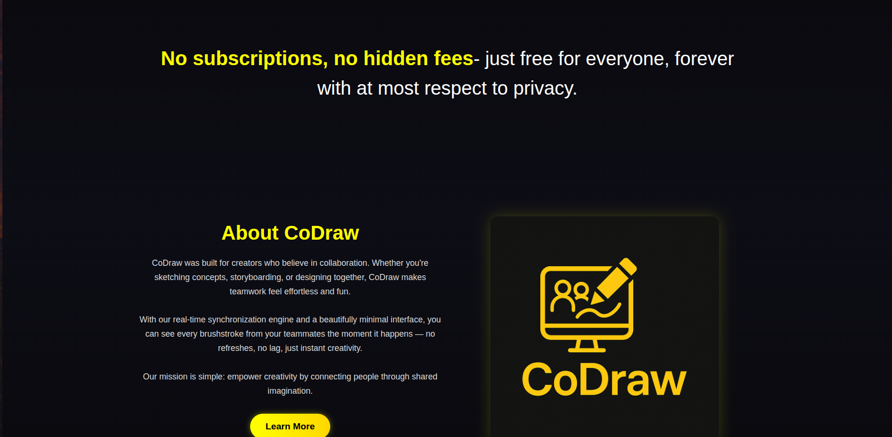
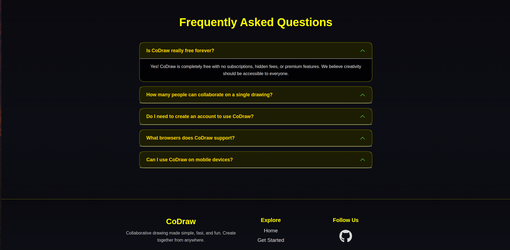

# CoDraw

An interactive whiteboard platform providing a seamless real-time collaborative experience. Create, share, and innovate together!

## Screenshots

### Landing Page


### Main Dashboard
<table>
  <tr>
    <td></td>
    <td></td>
  </tr>
</table>

### Drawing Board & Project Browser
<table>
  <tr>
    <td></td>
    <td></td>
  </tr>
</table>

### Footer


## Key Features

* **Real-time Collaboration**: Synchronized drawing across multiple users via WebSockets with instant updates and live cursors
* **Smart Project Discovery**: AI-powered natural language search to find projects by description, tags, or content
* **Easy Sharing**: Generate shareable links with customizable visibility (Public/Private) for seamless collaboration
* **Secure Authentication**: Email-based account creation with passkey authentication and password recovery flow
* **Rich Drawing Tools**: Comprehensive toolkit including shapes, text, freehand drawing, colors, and layering
* **Bookmark System**: Save and organize frequently accessed projects for quick access
* **Responsive Design**: Fully optimized for desktop, tablet, and mobile devices with touch controls

## Tech Stack

### Frontend
- **Vue.js 3** - Progressive JavaScript framework for building user interfaces
- **Bootstrap 5** - CSS framework for responsive, mobile-first design
- **Konva.js** - HTML5 Canvas library for high-performance drawing
- **FontAwesome** - Icon library for UI elements

### Backend
- **Django (ASGI)** - High-level Python web framework with asynchronous support
- **Daphne** - ASGI server for handling WebSocket connections
- **MongoDB** - NoSQL database for storing project data and user information
- **Redis** - In-memory data store for caching and session management

### Infrastructure & DevOps
- **Docker** - Containerization for consistent deployment environments
- **Nginx** - Reverse proxy and static file server
- **Prometheus** - Metrics collection and monitoring
- **Google Analytics** - Tracking and analytics for website traffic
- **Google Cloud Storage** - Cloud storage for project preview images

## How Technologies Communicate

### Client-Server Architecture
```
┌─────────────────┐      HTTPS/WSS      ┌──────────────────┐
│   Vue.js Client │◄──────────────────► │  Django Backend  │
│                 │                     │  (ASGI/Daphne)   │
└─────────────────┘                     └──────────────────┘
         │                                       │
         │                                       │
         ▼                                       ▼
   User Interactions                    ┌──────────────────┐
   - Drawing strokes                    │    MongoDB       │
   - Real-time updates                  │  (Data Storage)  │
   - Search queries                     └──────────────────┘
         │                                       │
         │                                       │
         ▼                                       ▼
   WebSocket Events                     ┌──────────────────┐
   (via Daphne)                         │     Redis        │
                                        │   (Caching &     │
                                        │    Sessions)     │
                                        └──────────────────┘
```

### Data Flow

**1. User Authentication Flow**
- Frontend (Vue.js) sends login credentials via HTTPS to Django
- Django validates credentials and creates session in Redis
- Session token is returned and stored in browser cookies
- Subsequent requests include the session token for authentication

**2. Real-time Drawing Collaboration**
- User draws on canvas (Konva.js captures mouse/touch events)
- Vue.js sends drawing data via WebSocket to Daphne ASGI server
- Django broadcasts updates to all connected clients in the same room
- Other users' canvases receive and render the updates in real-time
- Drawing state is periodically saved to MongoDB for persistence

**3. Project Search & Discovery**
- User enters search query in Vue.js interface
- Query is sent to Django REST API endpoint via HTTPS
- Django processes the query using natural language processing
- MongoDB aggregation pipeline searches across project metadata
- Results are cached in Redis for faster subsequent searches
- Results returned to frontend and displayed in browse view

**4. Image Upload & Storage**
- User saves project, triggering canvas toDataURL() conversion
- Vue.js converts data URL to Blob and sends via FormData (multipart/form-data)
- Django receives the file and uploads to Google Cloud Storage
- Signed URL is generated and stored in MongoDB with project metadata
- Preview images are served directly from GCS via signed URLs

**5. Monitoring & Observability**
- Django exposes metrics endpoints for Prometheus scraping
- Prometheus collects metrics on request latency, errors, and system health
- Google Analytics tracks website traffic
- Nginx logs are aggregated for traffic analysis
- Alerts configured in Grafana for anomaly detection

### Service Communication

| Component | Protocol | Purpose |
|-----------|----------|---------|
| Vue.js ↔ Django | HTTPS/REST | API calls for CRUD operations |
| Vue.js ↔ Daphne | WSS | Real-time WebSocket connections |
| Django ↔ MongoDB | MongoDB Wire Protocol | Data persistence |
| Django ↔ Redis | RESP | Caching and session storage |
| Django ↔ GCS | HTTPS | Image storage and retrieval |
| Nginx ↔ Django | HTTP/WSGI | Reverse proxy routing |
| Prometheus ↔ Django | HTTP | Metrics scraping |
